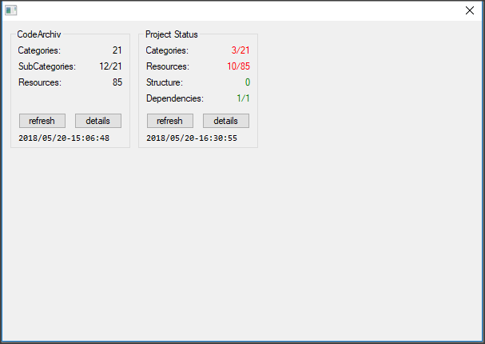

= Modules Roadmap

[WARNING]
================================================================================
THIS SECTION IS OLD AND MIGHT NOT REFLECT THE LATEST CHANGES!
================================================================================

I still need to work out properly how to move all the current functionality into separate modules. Presently, the main challenges are posed by the Error Tracking system, the Debug logging and the Final Report: in order to move any part of the current code to independent modules, I must first address these three systems so that they don't break down.

Then, I must decide which of the current HTML Creator functionality needs to be split in a module and which might be kept in main code -- basically, it boils down to what might be needed by other tools.

Because in PureBasic modules can't access main code, moving any functionality to a module is likely to force me to move commonly shared data to an independent module too. For example, implementing the GUI as a separate module will have an avalanche effect in this regard (which is why I'm taking so long to decide how to go about splitting up the current code).

These are tricky issues, so I should plan it well.

== Errors Management

=== Current Status

Currently the HTML Pages Creator has a dual approach to errors:

1.  Check Project Integrity Step
2.  Project processing errors managment

The two are independent from each other. The Project Integrity Step does some preliminary checks to verify if there are structural problems in the Archiv, but doesn't go as far as checking the integrity single resources. This is intended as a way to detect common problems before starting the conversion process. For this reason, errors are not tracked by this step, they are just reported to the user who is then asked if he still wants to go ahead.

The management of errors during processing is another thing altogether, and it's handled by the <<Errors Tracker,Errors Tracker>> Module, which is required to build a final report with statistics (which are useful to handle multiple errors).

=== Possible Changes

The current approach might not be suitable for the new design that is about to be implemented. This is due to the fact that the user will be able to pick and choose settings of how the project should be processed, possibly requiring a different model for the Check Project Integrity Step (eg: it might require that all resources be tested to).

Furthermore, a *Dry Run* option will also be available, which would allow to simulate the whole conversion process without actually writing to disk, in order to prevent chaning anything on disk until we're sure that the whole process is error free. It makes sense that a dry-run should redirect to a disk cache all the converted pages, so that after the test run it would be possible to confirm conversion without having to repeat the whole process froms scratch.

While the Error Track is not going to be affected by this, the Check Project Integrity Step is definitely going to be.

Also, I think that some data structures and/or functionality of the tracker could be reused by the new Project Integrity checker (but in a way that shouldn't affect the report).

Another thing to keep in mind is that some resource file checks will automatically correct some problems with the resource (eg: if in-file settings are found, they are removed on the spot).

== Log Module

Currently all logging is directly printed to the debug window via `Debug`. Since the app is about to become a GUI app, chances are that it might also be used as a compiled binary instead of simply being Run from the IDE; so I should consider that the debug window won't necessary be available. After all, using a compiled binary might improve performance, so the original motives to keep the app IDE-runnable no longer apply (it was mainly to keep it simple, but this is no longer the case).

Therefore, an independent log module should be created, and wherever the current code prints out text to the debug window, it should instead pass that text to the log module, which will then decide if and how to display it.

Log messages should be passed to the module with something like:

[source,purebasic]
----
log::logtext("some text", <DBG Level>)
----

... where `<DBG Level>` is a number representing the Debug Level of the text. This would allow the logger to decide if the text should be displayed or ignored, according to the current settings of the tool.

Maybe I could also add a third parameter, to indicate if the message should be considered as a `STDIN` or `STDERR` message -- so that console apps could redirect it correctly, and GUI apps might use this to handle text with different colors, etc, while other tools might just ignore this.

The whole point here seems to revolve around the fact that the Log module is probably going to be an intermediary between the various functionality modules and the main tool code; ie, the module is not going to actually handle the received text to produce some output, but instead make it available to the tool's main code, which will then decide how to display or store it.

So I might have to find a way to initialize the log module at startup, in order to register the procedures which the logger needs to interact with. Else, I could just store the data in the module namespace and expect the tool's maincode to retrive it on demand, by either accessing the raw data directly or by probing some exposed procedure of the log module. I must weigh the pros and cons of these diffrente approaches.

== GUI Introduction

The introduction of a GUI is going to be a bing change, affecting both data access and storage as well as user options to control details of the various checks, the conversion process, and how errors should be handled (eg, allowing to ignore errors for maintainance/dev purposes).

If on the one hand a GUI simplifies controlling settings, on the other it introduces new problems too because the possible combinations of user choices must be kept under control to prevent unwise mixtures and redundant behaviours.

It seems worth of building the GUI as a module (`GUI::`) so to make it accessible from other modules too. I haven't decided yet if user settings for the project should be stored in the GUI's module or in a separate module -- probably it's better to have a dedicated module for the Archiv data and info, settings included, just in case in future we might need a separate console tool for other purposes.

=== GUI Prototype

Currently, GUI testing and prototyping is being done in:

* link:../_tempwork/GUI_prototype/[`../_tempwork/GUI_prototype/`^]
** link:../_tempwork/GUI_prototype/protoGUI.pb[`protoGUI.pb`^] -- codebase of GUI
** link:../_tempwork/GUI_prototype/dummyGUI.pbf[`dummyGUI.pb`^] -- proof of concept via Form Designer
** link:../_tempwork/GUI_prototype/dummyGUI_screenshot.png[`dummyGUI_screenshot.png`^] -- proof of concept screenshot

Different approaches are being considered. Once a satisfying result is achieved (visually speaking), it will be moved to this folder to start integration.

=== Brainstorming

I need to brainstorm what the GUI should display to the user, and which options should be changeable and how.

As a general rule, the GUI should be divided in panel, each covering a given aspect of the project (info, error, conversion, etc.). Each panel should display elements resuming the overall status in a simple manner, and offer a button which can be clicked to get a pop-up window with detailed information.

Also, each panel should have a timestamp displaying when it was last refreshed, since some panel will be connected to different level of functionality -- refreshing one panel might render inactive other panels, depending on the cascading level of dependency amongst them, but the timestamp will always provide a visual clue to the last time it was updated (manually or automatically alike).

Some panels will also need to offer some button(s) to carry out actions, and maybe others to select options and settings.

The whole idea is to keep the GUI clean, avoiding too many entries (all that is not strictly necesary should be delegate to the pop-up window for details).

The tricky part is going to be keeping track of what changes, options and rereshes need to affect other panels and their settings -- one more reason to keep it simple in design.

Conceivably, there should be a progess status panel to indicate when the app is doing something. It should have both a counter (of the type `n/n`, indicating current step out of total steps) and a progress bar.

A log gadget of sorts should also be available, to display log info on the latest operation(s) carried out in the background -- the full log should be accessible in a pop-up window by clicking a button. Possibly, a WebGadget should be used, to allow basic text coloring to distinguish error and success messages (red, green) from neutral logs (grey). In the past I've already used the WebGadget for similar purposes, and it has always served me well (and comes with less problems than using other types of gadgets for the purpose).

The log gadget will have to communicate with the Log Module, most probably. A few intermediate procedures can easily handle this, and decide how to color the text, and when to reset the log gadget's text to make space for more recent log info -- as for the pop-up with the full log, it will depend on how the log module works: the full log might be either stored by the GUI or the log module.

==== Project Info Panel

The GUI should have a panel displaying info on the Archiv structure:

* Total Number of Categories (n)
** Number of Root Categories
** Number of Sub-Categories (s/n)
* Total Number of Resources (n)
** number of `.pb` resources
** number of `.pbi` resources
** number of `CodeInfo.txt` resources
* Last Updated (timestamp)

The above information should be gathered automatically at startup, but at any time the user can use a `refresh` button to update it (eg, if he has changed the files/folders in the meantime) -- refreshment of this dialog might imply resetting other dialogs too, because some changes in the Archiv might require running again some functions.

The *Last Updated* (timestamp: `YY/MM/DD-hh-mm-ss`) seems useful because different panels might be refreshed at different points in time, and if each panel has a timestamp it can be useful to keep track of their differences, and to work out why a panel is greyed out (ie, needs refreshing).

==== Project Errors Panel

Another panel should show statistic on problems found in the Archiv, either *structural problems* (missing READMEs, etc.) or *resource problems* (resources not passing the check tests).

Some error information might not be available at all times, so there must be a way to visually represent uncertainity -- eg, an entry might be `README.md`, intended to show if every Category has a `README.md` file, showing a green check if the test passed, a red cross if problems where found (and maybe also the number of errors), and a question mark if the matter is yet unknown.

So, the possible entries in such a panel could be:

* Project Structure:
** *READMEs* -- all Categories must have a `README.md`
** *YAML Settings* -- the Arhiv project needs a `meta.yaml` file.
* Resources:
** *syntax* -- reporting on how compilable resources passed the `--check --thread` compiler test. This one is tricky because I haven't yet understood how accurately the PBCompiler can check a sourcefile destined for another OS!
** *header comments* -- reporting if a resource passed all tests on its commented headers (obligatory keys, etc.)
** *include files* -- reporting if `.pbi` files contain the required `CompilerIf #PB_Compiler_IsMainFile` block.

Although incomplete, the above list makes it clear that a similar panel would be too cluttered to be practical. I should summarize the different problems in a few useful categories:

* *Proj Structure* (n) -- where `n` is the number of structural errors (if any)
* *Resources* (e/n) -- where `e` is the number of faulty resource over `n` (total num of resources)
* *Dependencies* (n) -- where `n` is the number of problems encountered with dependencies (pandoc, etc).

... and just assign to them a color based on status (green = ok, red = error, grey = unknown) and add next to them a number in braces showing the total count -- eg: *Resources (80)* in green = 80 resources, all passed the test; while *Resources (5/80)* in red = 80 resources, 5 of which didn't pass the test; and *Resources (80)* in grey = 80 resources, unknown status; while *Resources (?)* would indicate unknown number of resources and status.

And so on.

Looking at the proof of concept screenshot:

... the GUI's "*Project Status*" panel is telling us that:

* *Categories*: 3 out of 21 categories have problems which must be addressed. It could be that each category has more than one error, and that the error is tied specifically to the category structure (READMEs, etc) or even to a resource therein -- it ultimately depends on how we wish statistics to be shown.
* *Resources*: 10 out of 85 resources have problems that need to be addressed. It could be that a resource has more than one problem (invalid header, settings saved in file, and include file has no main block). In this case we can pinpoint the number of faulty resources OR the total number of resources related problems (it's a matter of choice).
* *Structure*: 0 structural problems found.
* *Dependencies*: 1/1 dependencies are OK.

This first prototype has brought to light that simplicity in the GUI could also introduce ambiguity of interpretation. We must decide how errors are counted -- WHAT COUNTS AS A CATEGORY ERROR? ANY ERROR, INCLUDING RESOURCES?.

Of course, the `details` button will pop-up a detailed resume of all these problems, leaving no ambiguity of interpretations; nevertheless, *this has brought to attention the issue of how to classify and count problems in GUI panels* -- we can't create an entry for each separate problem, but grouping multiple problems under a same entry creates ambiguity.

The panel should then have an `Info` button which can be clicked to produce a pop-up window with a full status report -- structure, resources and dependencies, listing all the known problems and statistics. This would be a much cleaner approach (instead of a cluttered panel) and still allow access to full status details from within the GUI.

// EOF //
